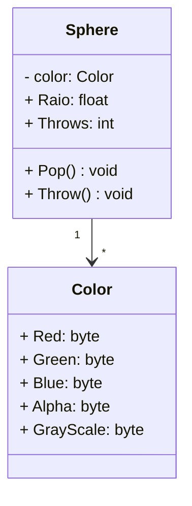

```mermaid
classDiagram
    class Color{
        + Red: byte
        + Green: byte
        + Blue: byte
        + Alpha: byte
        + GrayScale: byte
    }

    class Sphere{
        - color: Color
        + Raio: float
        + Throws: int

        + Pop() void
        + Throw() void
    }

    Sphere "1" --> "*" Color
```
